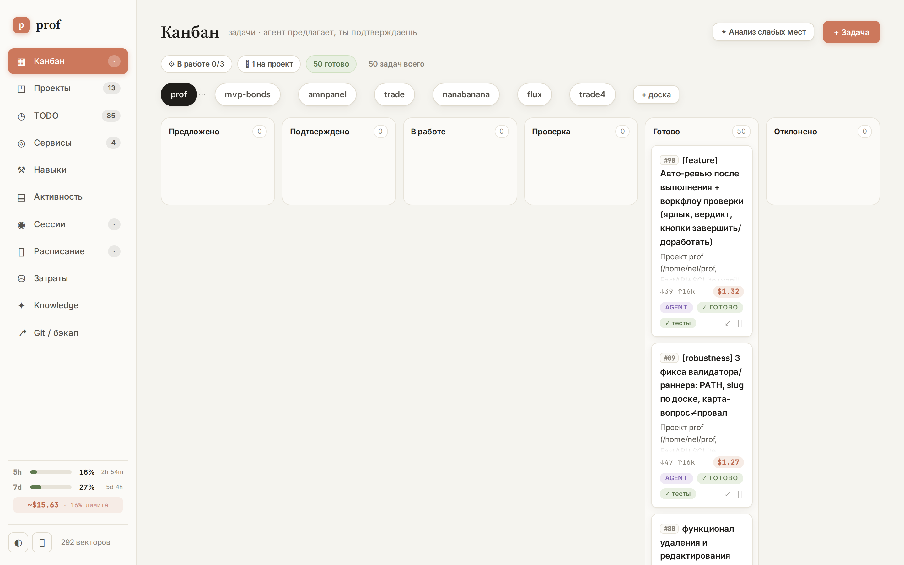

# claudepilot

> Self-driving kanban for Claude Code agents — propose a task, approve it, and a headless `claude` agent does the work while Claudepilot tracks progress, validates the result, and meters your token budget.

*Канбан-автопилот для агентов Claude Code — поставь задачу, подтверди её, и headless-агент `claude` сделает работу, пока Claudepilot следит за прогрессом, валидирует результат и считает бюджет токенов.*

[](LICENSE)
[](https://www.python.org/)
[](https://fastapi.tiangolo.com/)
[](https://www.sqlite.org/)
[](https://claude.com/claude-code)

🇬🇧 [English](#english) · 🇷🇺 [Русский](#русский)



---

## English

### What it is

Claudepilot is a single-process FastAPI dashboard that turns a kanban board into an
orchestrator for **headless Claude Code agents**. You drop a task card with a prompt,
move it to *Approved*, and Claudepilot spawns `claude -p ...` as a child process, streams
its progress live, runs deterministic validation on the result (tests / lint / git delta),
and books the token cost against your subscription's 5h / 7d windows.

It's a personal cockpit: one operator decomposes goals into cards, the board runs them
under a WIP limit, and you stay in the loop only where a human decision is needed
(approve, answer a question, review).

### Features

- **Kanban orchestration** — columns `Proposed → Approved → In progress → Review → Done`
  (+ `Rejected`). Approving a card launches a headless agent; drag & drop in the UI.
- **Auto-agent ("weak-spot analysis")** — reads a project's README, code, and memory and
  proposes 3–6 concrete tasks (tech debt, risks, missing tests, open TODOs) into *Proposed*.
- **Live progress** — server-sent events stream the agent's running output, token count and
  cost per card; "waiting for input" detection via Claude Code hooks.
- **Deterministic validation** — after a run, Claudepilot runs the project's tests/lint and
  compares the failing-test count against a baseline taken before the run, so a card only
  passes if it didn't *add* red.
- **Agent review** — an optional second headless agent reads the changes and votes
  `DONE` / `REWORK`.
- **Budget & model routing** — tasks default to Sonnet; Opus only on an explicit complexity
  marker (`[opus]`, `[hard]`, …). New tasks queue when the 5h window utilization is too high.
- **Cost accounting** — per-card and per-project token/USD breakdown, including manual
  console sessions, parsed from `~/.claude/projects/*.jsonl`.
- **Parallelism modes** — `project` (one task per project), `worktree` (isolated git
  worktree per card, merged on success), or `off`, with a configurable WIP limit.
- **Project memory & vector search** — browses `~/.claude/projects/<slug>/memory/` and an
  optional knowledge base; semantic search via sqlite-vec + fastembed, with text fallback.
- **Uptime monitoring** — ping registered service URLs; on failure, one click spawns an
  audit-fix task.
- **Integrations** — MCP server status, Telegram notifications, Obsidian sync, automatic
  git backup of the board state, deploy-lag detection (pushed but not deployed).
- **CLI + Skill** — a thin stdlib CLI (`prof_cli.py`) and a Claude Code skill let an agent
  manage the board from inside a session (self-orchestration with near-zero token overhead).

### Architecture

Backend is one FastAPI process; the frontend is a single vanilla `index.html` (no build step).

| Module | Responsibility |
|---|---|
| `app.py` | All HTTP routes, auth middleware, lifespan (reaper + git auto-backup), memory/KB reading, cost aggregation |
| `db.py` | SQLite layer (`prof.db`, WAL): boards / cards / services / mcp / settings / projects |
| `services.py` | Spawning, validating and reaping cards; git worktrees; model routing; usage/quota; pings; MCP/skills discovery; Obsidian; Telegram |
| `sessions.py` | Parses Claude `*.jsonl` sessions for cost, 5h windows and quota breakdown |
| `vectors.py` | Optional semantic search (sqlite-vec + fastembed), degrades to text search |
| `prof_cli.py` | Thin stdlib CLI over the HTTP API |

**Card lifecycle.** `Approved` → `start_card` (checks WIP limit + parallelism lock) →
`_spawn_card` launches `claude -p <prompt> --output-format stream-json` as a detached child
(survives a service restart); output goes to `runs/card_<id>.out` (NDJSON), exit code to
`.rc`. A background **reaper** (3s tick) sees the `.rc`, parses the final usage/cost event,
validates, and moves the card forward or back. Live progress is an SSE stream; "agent is
waiting for input" is detected from `runs/waiting/<sid>.json` markers written by the
`hooks/prof_waiting.sh` Claude Code hook.

### Requirements

- Python 3.11+
- [Claude Code](https://claude.com/claude-code) CLI on `PATH` (`claude`)
- `jq` (for the waiting-input hook)
- Optional: `git` (worktree mode + backup), `node`/`npx` for JS-project validation

### Quick start

```bash
python -m venv .venv && .venv/bin/pip install -r requirements.txt
cp .env.example .env          # set PROF_TOKEN at minimum
./start.sh                    # → http://127.0.0.1:7777
```

Run in the background as a user service with the provided unit (see `prof.service.bak`).

```bash
# CLI (from inside a Claude session or terminal)
PROF_TOKEN=… .venv/bin/python prof_cli.py status --json
.venv/bin/python prof_cli.py add --board -home-nel-prof --title "Fix X" --prompt "Do Y"
.venv/bin/python prof_cli.py run 42
```

### Configuration

All via environment (see `.env.example`):

| Var | Default | Purpose |
|---|---|---|
| `PROF_TOKEN` | auto-generated | Bearer token required for mutating requests (POST/PUT/PATCH/DELETE) |
| `PROF_HOST` | `127.0.0.1` | Bind host (`0.0.0.0` to expose on the LAN) |
| `PROF_PORT` | `7777` | Port |
| `PROF_RELOAD` | `1` | Watch `runs/.reload-trigger` for safe hot-reload; `0` to disable |

Telegram credentials and per-project settings are stored in the SQLite `settings` table
(set from the UI), with env taking precedence for Telegram.

### Security

GET endpoints (reading boards/memory/uptime) are open; all mutations require the bearer
token. Agents run with `--dangerously-skip-permissions`, so **run Claudepilot only on a
host and network you trust** and keep `PROF_HOST=127.0.0.1` unless you understand the
exposure. The board database (`prof.db`) is **not** committed in this public repo — it can
contain your prompts, project paths and tokens.

### Tests

```bash
.venv/bin/python -m pytest          # all
.venv/bin/python -m pytest tests/test_validate.py -q
```

### License

MIT — see [LICENSE](LICENSE).

> Claudepilot is an independent project and is not affiliated with or endorsed by Anthropic.
> "Claude" and "Claude Code" are trademarks of Anthropic.

---

## Русский

### Что это

Claudepilot — дашборд на FastAPI (один процесс), который превращает канбан-доску в
оркестратор **headless-агентов Claude Code**. Создаёшь карточку с заданием, переводишь её
в *Подтверждено* — и Claudepilot запускает `claude -p ...` дочерним процессом, стримит
прогресс, прогоняет детерминированную валидацию результата (тесты / линт / git-дельта) и
записывает стоимость в токенах против окон подписки 5ч / 7д.

Это личный «кокпит»: один оператор декомпозирует цели на карточки, доска выполняет их под
WIP-лимитом, а ты вмешиваешься только там, где нужно решение человека (подтвердить,
ответить на вопрос агента, проверить).

### Возможности

- **Канбан-оркестрация** — колонки `Предложено → Подтверждено → В работе → Проверка →
  Готово` (+ `Отклонено`). Подтверждение карточки запускает агента; drag & drop в UI.
- **Авто-агент («анализ слабых мест»)** — читает README, код и память проекта и предлагает
  3–6 конкретных задач (техдолг, риски, отсутствующие тесты, незакрытые TODO) в *Предложено*.
- **Live-прогресс** — SSE стримит вывод агента, счётчик токенов и стоимость по карточке;
  детект «агент ждёт ввода» через хуки Claude Code.
- **Детерминированная валидация** — после прогона запускаются тесты/линт проекта, число
  падающих тестов сравнивается с baseline до запуска: карточка проходит, только если задача
  не *добавила* красного.
- **Агентное ревью** — опциональный второй headless-агент читает изменения и выносит
  вердикт `DONE` / `REWORK`.
- **Бюджет и роутинг моделей** — задачи по умолчанию на Sonnet; Opus только по явному
  маркеру сложности (`[opus]`, `[сложно]`, …). Новые задачи встают в очередь, когда
  утилизация 5ч-окна слишком высока.
- **Учёт стоимости** — разбивка токенов/USD по карточкам и проектам, включая ручные
  консольные сессии, из `~/.claude/projects/*.jsonl`.
- **Режимы параллелизма** — `project` (одна задача на проект), `worktree` (изолированный
  git-worktree на карточку, мерж при успехе) или `off`, с настраиваемым WIP-лимитом.
- **Память проектов и векторный поиск** — обзор `~/.claude/projects/<slug>/memory/` и
  опциональной базы знаний; семантический поиск через sqlite-vec + fastembed, фолбэк на текст.
- **Uptime-мониторинг** — пинг зарегистрированных URL; при падении одним кликом создаётся
  задача аудита-фикса.
- **Интеграции** — статус MCP-серверов, уведомления в Telegram, синк в Obsidian, авто-бэкап
  состояния доски в git, детект «запушено, но не задеплоено».
- **CLI + Skill** — тонкий stdlib-CLI (`prof_cli.py`) и skill Claude Code позволяют агенту
  управлять доской прямо из сессии (само-оркестрация почти без оверхеда токенов).

### Архитектура

Бэкенд — один процесс FastAPI; фронт — единственный vanilla-`index.html` (без сборки).

| Модуль | Ответственность |
|---|---|
| `app.py` | Все HTTP-роуты, auth-middleware, lifespan (reaper + git-автобэкап), чтение памяти/KB, агрегации стоимости |
| `db.py` | Слой SQLite (`prof.db`, WAL): boards / cards / services / mcp / settings / projects |
| `services.py` | Спавн/валидация/реап карточек; git-worktree; роутинг моделей; usage/quota; пинги; дискавери MCP/skills; Obsidian; Telegram |
| `sessions.py` | Парсинг `*.jsonl` сессий Claude → стоимость, окна 5ч, разбивка квоты |
| `vectors.py` | Опциональный семантический поиск (sqlite-vec + fastembed), деградирует в текстовый |
| `prof_cli.py` | Тонкий stdlib-CLI поверх HTTP-API |

**Жизненный цикл карточки.** `Подтверждено` → `start_card` (проверяет WIP-лимит +
parallelism-лок) → `_spawn_card` запускает `claude -p <prompt> --output-format stream-json`
отдельным дочерним процессом (переживает рестарт сервиса); вывод → `runs/card_<id>.out`
(NDJSON), код возврата → `.rc`. Фоновый **reaper** (тик 3с) видит `.rc`, парсит финальное
событие usage/cost, валидирует и двигает карточку вперёд или назад. Live-прогресс — SSE;
«агент ждёт ввода» определяется по маркерам `runs/waiting/<sid>.json`, которые пишет хук
`hooks/prof_waiting.sh`.

### Требования

- Python 3.11+
- CLI [Claude Code](https://claude.com/claude-code) в `PATH` (`claude`)
- `jq` (для хука «ждёт ввода»)
- Опционально: `git` (worktree + бэкап), `node`/`npx` для валидации JS-проектов

### Быстрый старт

```bash
python -m venv .venv && .venv/bin/pip install -r requirements.txt
cp .env.example .env          # задай как минимум PROF_TOKEN
./start.sh                    # → http://127.0.0.1:7777
```

В фоне — как user-сервис из приложенного юнита (см. `prof.service.bak`).

```bash
# CLI (изнутри сессии Claude или из терминала)
PROF_TOKEN=… .venv/bin/python prof_cli.py status --json
.venv/bin/python prof_cli.py add --board -home-nel-prof --title "Починить X" --prompt "Сделай Y"
.venv/bin/python prof_cli.py run 42
```

### Конфигурация

Всё через окружение (см. `.env.example`):

| Переменная | По умолчанию | Назначение |
|---|---|---|
| `PROF_TOKEN` | генерится | Bearer-токен для мутаций (POST/PUT/PATCH/DELETE) |
| `PROF_HOST` | `127.0.0.1` | Хост (`0.0.0.0` — открыть в сети) |
| `PROF_PORT` | `7777` | Порт |
| `PROF_RELOAD` | `1` | Следить за `runs/.reload-trigger` для безопасного hot-reload; `0` — выключить |

Telegram-доступы и пер-проектные настройки хранятся в таблице `settings` SQLite
(задаются из UI), для Telegram env имеет приоритет.

### Безопасность

GET-эндпоинты (чтение досок/памяти/uptime) открыты; все мутации требуют bearer-токен.
Агенты запускаются с `--dangerously-skip-permissions`, поэтому **запускай Claudepilot
только на хосте и в сети, которым доверяешь**, и держи `PROF_HOST=127.0.0.1`, если не
понимаешь рисков открытия. База доски (`prof.db`) **не** коммитится в этот публичный
репозиторий — она может содержать твои промпты, пути проектов и токены.

### Тесты

```bash
.venv/bin/python -m pytest          # все
.venv/bin/python -m pytest tests/test_validate.py -q
```

### Лицензия

MIT — см. [LICENSE](LICENSE).

> Claudepilot — независимый проект, не аффилирован с Anthropic и не одобрен ею.
> «Claude» и «Claude Code» — товарные знаки Anthropic.
